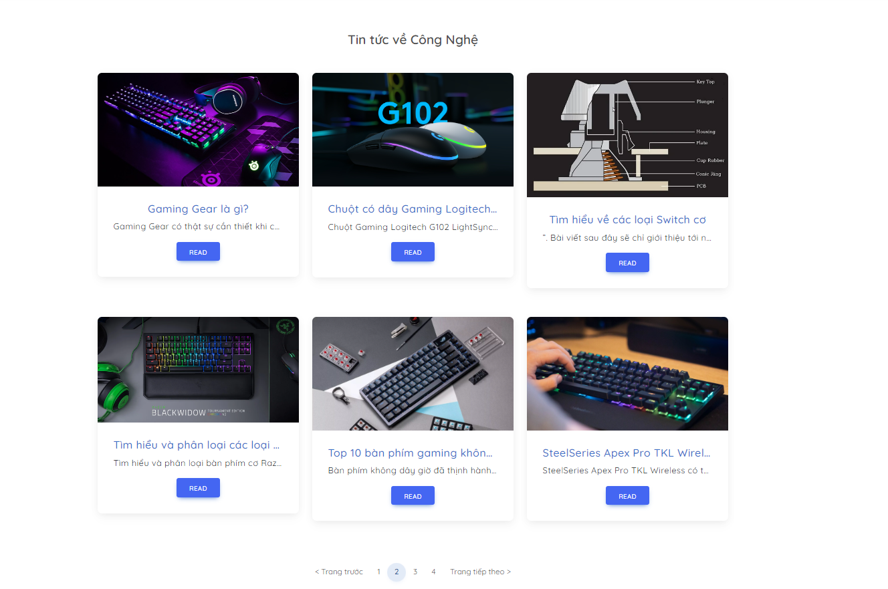

<h1>Web User Interface</h1>
<h3> Description  </h5>
This is the source code built using HTML,CSS , Js and ReactJS library. Provide users with an interface to use when buying and selling products, see the blogs ,...
<h3>Technologies</h3>
<h5> Core </h5> 

HTML5 + CSS3 + JavaScript + ReactJS

<h5> Framework </h5>

- Axios

- Bootstrap

- React Hooks

- React hook form

- React-toastify

- React/Redux

- React Router

- React Paginate

- Tailwindcss

- Fortawesome

<h5>Tools</h5>

- Visual Studio Code

- Google dev tool

<h2 align="center"> Some Pictures </h2>
 

   
   
   
   
  

